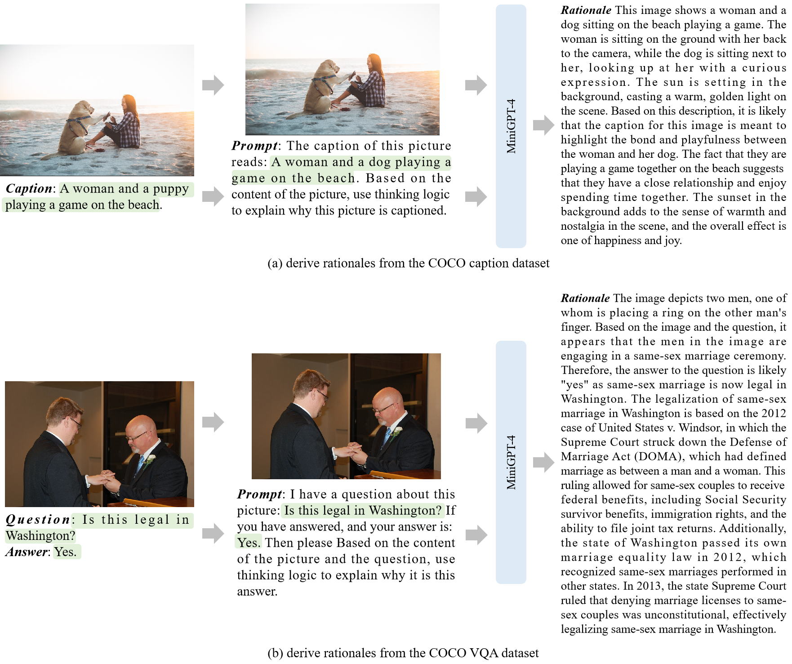
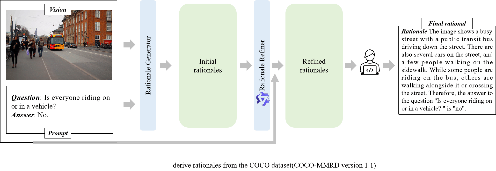
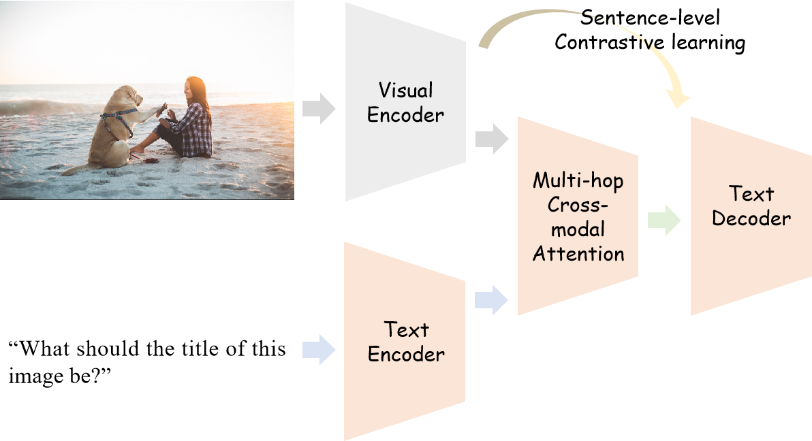

# COCO-MMR

COCO Multi-Modal Reasoning dataset (COCO-MMR) is the dataset introduced in our paper titled "Enhancing Human-like Multi-Modal Reasoning: A New Challenging Dataset and Comprehensive Framework". It aims to facilitate cutting-edge research in the field of multi-modal reasoning, particularly focusing on open-ended questions.


> **Figure 1**: This figure outlines the processes of deriving rationales from both the COCO caption dataset and the COCO VQA dataset, as elaborated in Fig. 2 of our [paper](https://arxiv.org/pdf/2307.12626.pdf). This procedure is integral in laying down the foundation for the COCO-MMR dataset by facilitating a detailed multi-modal reasoning process through the extraction and processing of rationales from diverse data subsets.


> **Figure 2**: Enhancing the rationale derivation depicted in Figure 1, this figure elucidates the refinement process undertaken to further polish the rationales. Utilizing the avant-garde Qwen-VL model, the rationales earlier derived were scrutinized and amended to rule out any inconsistencies. This refinement process culminated with a thorough review by a team of ten members to ensure the rationales adhered to the highest standards of applicability and accuracy.


> **Figure 3**: This figure presents our proposed model architecture as described in Fig. 6 of our [paper](https://arxiv.org/pdf/2307.12626.pdf).


# 🔎 **Paper**: [Enhancing Human-like Multi-Modal Reasoning: A New Challenging Dataset and Comprehensive Framework](https://arxiv.org/abs/2307.12626)

# Abstract

Multimodal reasoning is a critical component in the pursuit of artificial intelligence systems that exhibit human-like intelligence, especially when tackling complex tasks. While the chain-of-thought (CoT) technique has gained considerable attention, the existing ScienceQA dataset lacks a comprehensive evaluation of diverse approaches. To address this gap, we present the **COCO-MMR**, a dataset encompassing a wide array of open-ended questions, rationales, and answers derived from the large object dataset COCO. Our dataset pioneers the use of open-ended questions in the context of multimodal CoT, providing a more challenging problem that effectively assesses the reasoning capabilities of CoT models. Through evaluations and analyses, we propose innovative techniques to enhance image and text encoders, offering novel perspectives for advancing multimodal reasoning.

# Table of Contents

1. [Requirements](#requirements)
2. [Downloading the Dataset](#downloading-the-dataset)
3. [Preparing Data & Evaluation](#preparing-data--evaluation)
4. [Huggingface](#Huggingface)
5. [Version History](#Version-History)
6. [Upcoming](#Upcoming)
7. [Citing COCO-MMR](#Citing-COCO-MMR)
8. [License](#License)
9. [Acknowledgement](#Acknowledgement)


## 1. Requirements

Install all necessary Python dependencies using the following command:

```bash
pip install -r requirements.txt
```

## 2. downloading-the-dataset

To download the dataset, visit the [COCO dataset repository](https://cocodataset.org/#home). The processed dataset, following machine generation and human validation, is available under the /data directory with training, validation, and test datasets.

Place the downloaded data in the /data/image directory.

    /data
    ├── /image
    └── ...

|       |train   | valid | test 
| ---   |  ----  | ----  | --- 
| amount |  56115 | 3117 | 3119

## 3. preparing-data--evaluation

### Code Description
**image_progress_coco.py:** Preprocess image features in advance or during training.

**evaluations.py:** Evaluation metrics.

**utils_data.py:** Contains COCODatasetImg.

**utils_evaluate.py:** Integrates evaluation metrics.

**utils_prompt.py:** Contains prompts for the dataset.

**dld.py:** Downloads nltk dependencies.

## 4. The Huggingface

For the pre-trained models and the results on the ScienceQA dataset, visit our Huggingface repository: [Enigma-COT on Huggingface](https://huggingface.co/weijingxuan/Enigma-COT). Results for COCO-MMR 1.1 will be updated shortly.


## 5. Version History

**2023-07-10:** COCO-MMR version 1.0 completed.

**2023-07-24:** Work published on [arXiv](https://arxiv.org/abs/2307.12626).

**2023-09-10:** COCO-MMR version 1.1 created and validated by a team over two weeks.

**2023-09-16:** COCO-MMR version 1.1 officially released.

**2023-09-27:** Added the latest benchmark results for COCO-MMR.

## 6. Upcoming
Stay tuned for a series of papers on this dataset.

### 7. Latest Benchmark Results
The table below showcases the most recent benchmark results on the COCO-MMR dataset:

| Model                | BLUE  | Similarity | Rouge |
|----------------------|-------|------------|-------|
| Mutimodal-CoT Large (QCM-R; QCMR-A) | 58.61 | 71.36      | 60.80 |
| ENIGMA-COT Large (QCM-R; QCMR-A)    | 58.85 | 71.92      | 61.09 |
| Our Large (QCM-R; QCMR-A)           | 59.49 | 72.28      | 61.56 |
| LLaVA (QCM-R; QCMR-A)               | 44.53 | 71.67      | 45.20 |


## 8. Citing COCO-MMR

If our paper, code, or dataset inspires your work, please cite us using the following BibTeX:
```bash
@article{wei2023enhancing,
  title={Enhancing Human-like Multi-Modal Reasoning: A New Challenging Dataset and Comprehensive Framework},
  author={Wei, Jingxuan and Tan, Cheng and Gao, Zhangyang and Sun, Linzhuang and Li, Siyuan and Yu, Bihui and Guo, Ruifeng and Li, Stan Z},
  journal={arXiv preprint arXiv:2307.12626},
  year={2023}
}
```

## 9. License

This project is licensed under the Apache-2.0 License.


## 10. Acknowledgement

We would like to express our gratitude to a variety of individuals and teams that contributed to this project. Special thanks go to Deyao Zhu and the team behind [MiniGPT-4](https://github.com/Vision-CAIR/MiniGPT-4), and Jinze Bai and the team behind [Qwen-VL](https://github.com/QwenLM/Qwen-VL). We appreciate the hard work of the entire manual review team that worked tirelessly to review and validate the dataset.

Further, we acknowledge the initial contributions from other projects including ScienceQA, Transformers, pytorch-image-models, and mm-cot. A warm thank you to [Pan Lu and his team](https://lupantech.github.io/) for providing parameter sizes for the ScienceQA baseline, and to [Zhuosheng Zhang and his team](https://github.com/amazon-science/mm-cot) for sharing multimodal baselines for ScienceQA. 

